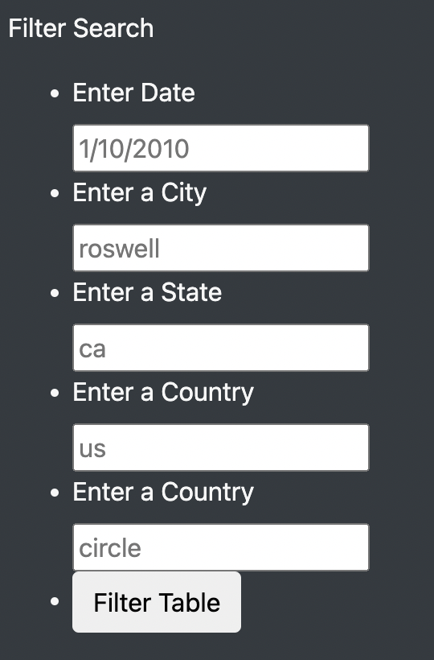
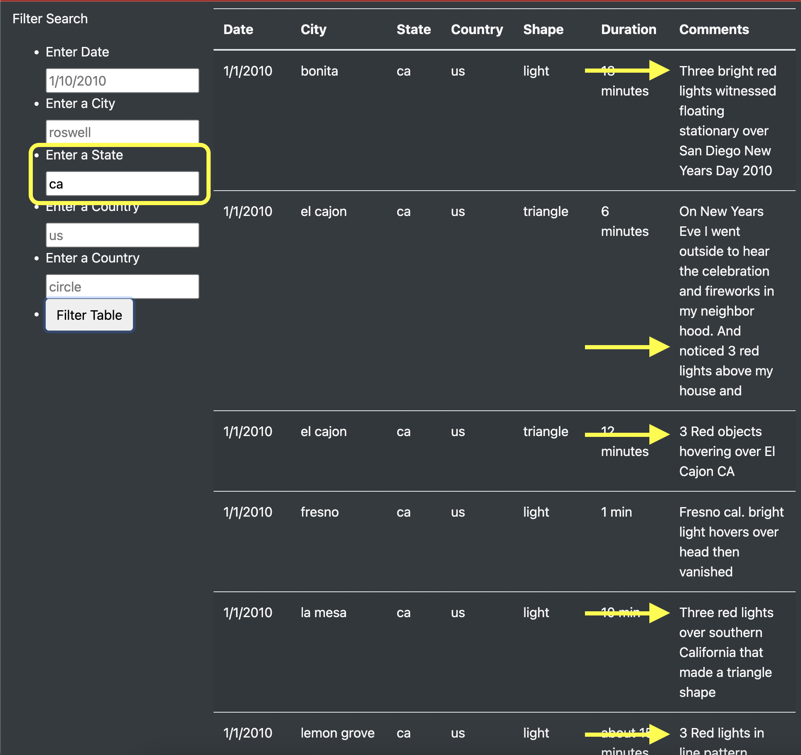

# 11-UFO-Sightings-lukeperrin
## Overview

This web app compiles information about UFO sightings using HTML and JS. The app pulls data from a database of different UFO sightings across the world, each with a location and description. Using the table and its multi-filter functionality, one can search through these sightings and their details.

## Results

### Filtering

This app can be used by entering different values for each of the criteria listed:

Using these criteria we can look at specific single criteria, such as all sightings that occurred on January 1st, 2010:

### Finding Reports of the Same UFO

Ultimately, this can be used to find if there were multiple sightings of the same UFO (see example of multiple reports of “three red lights” seen in `ca` :

## Summary

It would be ideal to be able to layer the filters (e.g. you could filter all sightings in `ca` on `1/10/2010` ). Additionally, being able to search keywords in the `Comments` field would be helpful to find similar descriptions of multiple reports of the same object (e.g. `red`).
